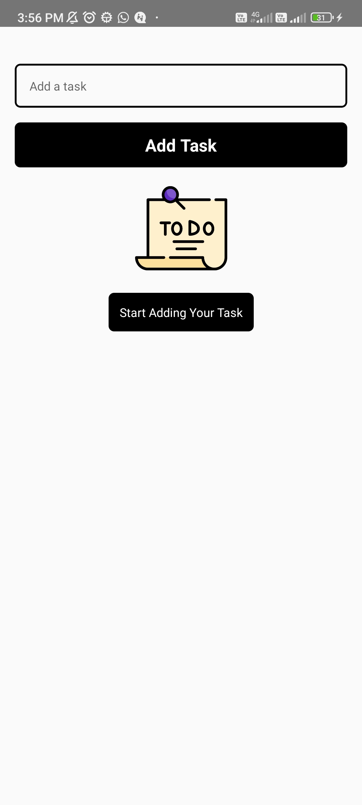
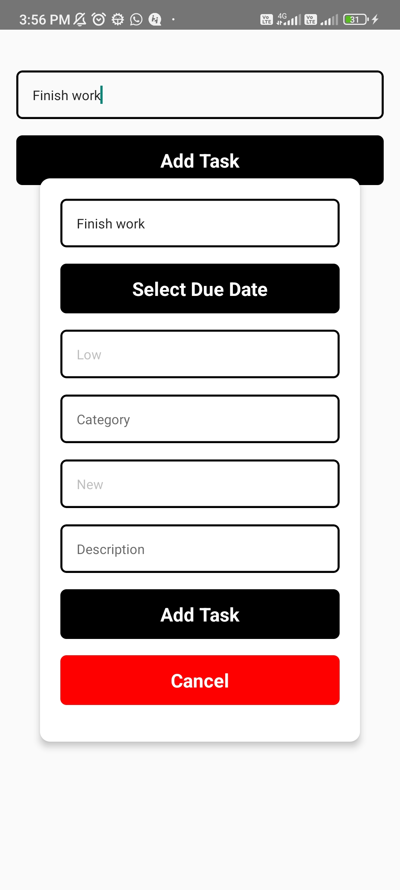
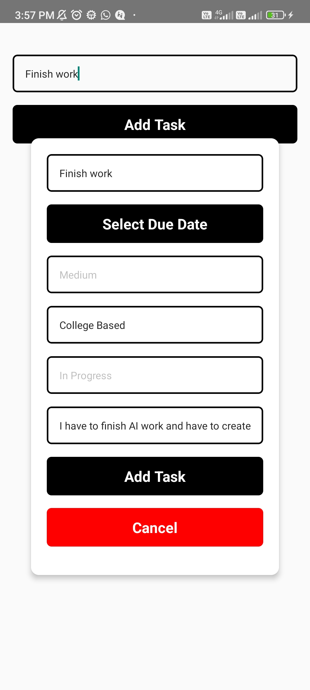
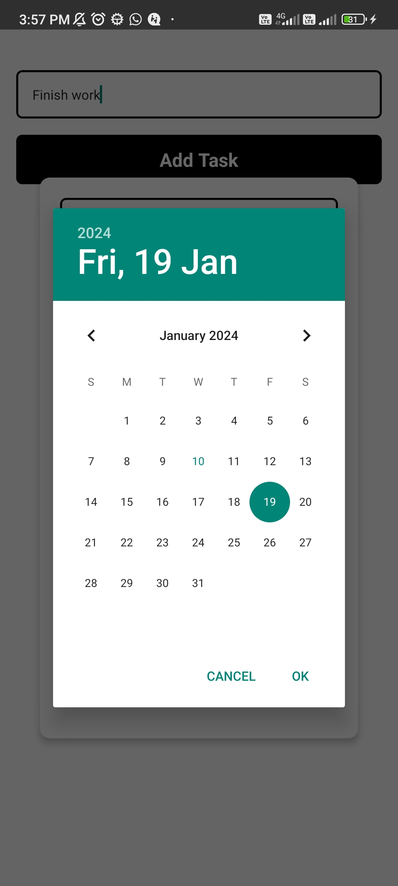
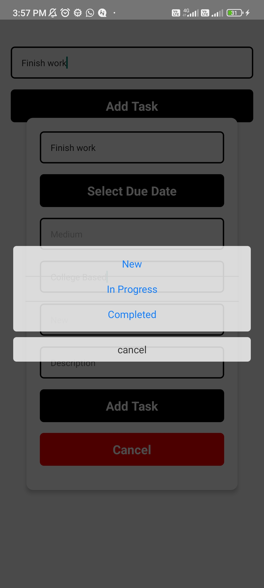
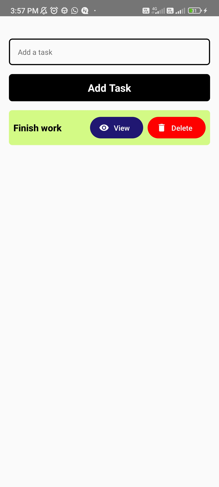
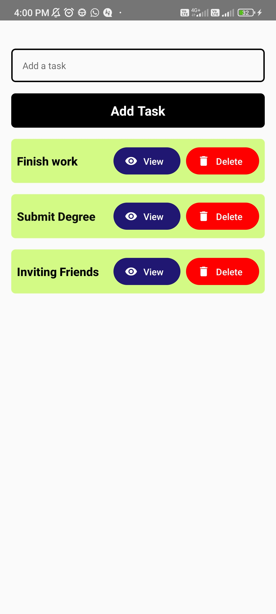
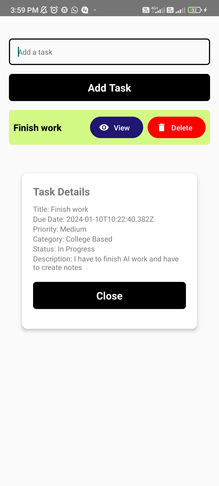

# React Native Todo App

This is a simple Todo App built with React Native, allowing users to add, edit, view, and delete tasks.

## Requirements

- Node.js (https://nodejs.org/)
- React Native CLI (https://reactnative.dev/docs/environment-setup)
- Yarn package manager (optional, but recommended) (https://yarnpkg.com/)

## Getting Started

1. **Clone the repository:**

    ```bash
    git clone <repository_url>
    cd react-native-todo-app
    ```

2. **Install dependencies:**

    ```bash
    npm install
    # or with yarn
    yarn
    ```

3. **Run the app:**

    ```bash
    npx react-native run-android
    # or
    npx react-native run-ios
    ```

    Ensure that you have set up the necessary development environment for your target platform.

## Objective

Develop an intuitive and user-friendly to-do list application with key features for effective task management.

## Key Features and Requirements

- **Due Date**: Each task includes a due date to help users track deadlines.
- **Priority Levels**: Assign priority to tasks as Low, Medium, or High for better task organization.
- **Category**: Categorize tasks to group them based on different criteria.
- **Task Status**: Mark tasks as New, In Progress, or Completed to track their progress.
- **Title and Description**: Provide a title and a detailed description for each task.
- **Local Storage**: Utilize local storage to save tasks and ensure data persistence.


## Features

- Add new tasks with a title, due date, priority, category, status, and description.
- View a list of tasks.
- Edit existing tasks.
- Delete tasks.
- View task details in a modal.

## Screenshots










## Folder Structure

- **components:** Contains reusable components. (e.g., Fallback component)
- **screens:** Contains the main screens of the app. (e.g., TodoScreen)

## Additional Packages Used

- `@react-native-community/datetimepicker`: Date and time picker component.
- `react-native-modal-selector`: Modal selector for dropdown options.
- `@react-native-async-storage/async-storage`: AsyncStorage for storing tasks locally.

